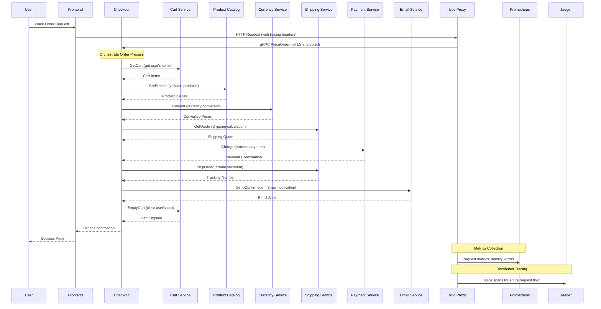

# Hipster Shop: Complete Microservices Architecture & Technology Stack

This comprehensive guide explains the entire Hipster Shop project - a production-ready Kubernetes platform demonstrating modern cloud-native technologies, microservices architecture, and operational excellence.

## 🎯 Project Overview

The Hipster Shop is a **complete cloud-native learning platform** built on Google's Online Boutique microservices demo, enhanced with enterprise-grade infrastructure, security, observability, and operational tools. It serves as both a **learning laboratory** and **production blueprint** for modern Kubernetes operations.

### Why This Project Exists

**Learning & Education**
- Hands-on experience with 20+ cloud-native technologies
- Real-world microservices patterns and challenges
- Production-grade operational practices
- Progressive complexity from basic to advanced concepts

**Production Readiness**
- Enterprise security and compliance
- Complete observability and monitoring
- Disaster recovery and business continuity
- Cost optimization and resource efficiency

**Operational Excellence**
- GitOps workflows and automation
- Policy-driven governance
- Chaos engineering and resilience testing
- Comprehensive documentation and runbooks

## 🏗️ Complete Architecture Overview

```
┌─────────────────────────────────────────────────────────────────────────────────┐
│                              EXTERNAL LAYER                                      │
│  ┌─────────────┐    ┌──────────────┐    ┌─────────────────┐                     │
│  │   Browser   │───▶│ Let's Encrypt│───▶│ DigitalOcean DNS│                     │
│  └─────────────┘    └──────────────┘    └─────────────────┘                     │
└─────────────────────────────────────────────────────────────────────────────────┘
                                   │
                                   ▼
┌─────────────────────────────────────────────────────────────────────────────────┐
│                              INGRESS LAYER                                      │
│  ┌─────────────┐    ┌──────────────┐    ┌─────────────────┐                     │
│  │ NGINX       │───▶│ Cert-Manager │───▶│ External DNS    │                     │
│  │ Ingress     │    │ (TLS Certs)  │    │ (Auto DNS)      │                     │
│  └─────────────┘    └──────────────┘    └─────────────────┘                     │
└─────────────────────────────────────────────────────────────────────────────────┘
                                   │
                                   ▼
┌─────────────────────────────────────────────────────────────────────────────────┐
│                            SERVICE MESH LAYER                                   │
│  ┌─────────────┐    ┌──────────────┐    ┌─────────────────┐                     │
│  │ Istio       │───▶│ Envoy Proxy  │───▶│ mTLS Security   │                     │
│  │ Control     │    │ (Sidecar)    │    │ Traffic Mgmt    │                     │
│  └─────────────┘    └──────────────┘    └─────────────────┘                     │
└─────────────────────────────────────────────────────────────────────────────────┘
                                   │
                                   ▼
┌─────────────────────────────────────────────────────────────────────────────────┐
│                           APPLICATION LAYER                                     │
│  ┌─────────────┐  ┌─────────────┐  ┌─────────────┐  ┌─────────────┐             │
│  │  Frontend   │  │    Cart     │  │  Product    │  │  Currency   │             │
│  │   (Go)      │  │   (C#)      │  │ Catalog(Go) │  │ (Node.js)   │             │
│  └─────────────┘  └─────────────┘  └─────────────┘  └─────────────┘             │
│                                                                                 │
│  ┌─────────────┐  ┌─────────────┐  ┌─────────────┐  ┌─────────────┐             │
│  │  Checkout   │  │  Payment    │  │  Shipping   │  │    Email    │             │
│  │   (Go)      │  │ (Node.js)   │  │   (Go)      │  │  (Python)   │             │
│  └─────────────┘  └─────────────┘  └─────────────┘  └─────────────┘             │
│                                                                                 │
│  ┌─────────────┐  ┌─────────────┐  ┌─────────────┐                             │
│  │Recommendation│  │     Ad      │  │    Load     │                             │
│  │  (Python)   │  │   (Java)    │  │ Generator   │                             │
│  └─────────────┘  └─────────────┘  └─────────────┘                             │
└─────────────────────────────────────────────────────────────────────────────────┘
                                   │
                                   ▼
┌─────────────────────────────────────────────────────────────────────────────────┐
│                          PLATFORM SERVICES                                     │
│  ┌─────────────┐  ┌─────────────┐  ┌─────────────┐  ┌─────────────┐             │
│  │ Prometheus  │  │   Grafana   │  │    Loki     │  │   Jaeger    │             │
│  │ (Metrics)   │  │(Dashboards) │  │  (Logs)     │  │ (Tracing)   │             │
│  └─────────────┘  └─────────────┘  └─────────────┘  └─────────────┘             │
│                                                                                 │
│  ┌─────────────┐  ┌─────────────┐  ┌─────────────┐  ┌─────────────┐             │
│  │   ArgoCD    │  │   Velero    │  │ Chaos Mesh  │  │  Kubecost   │             │
│  │  (GitOps)   │  │ (Backup)    │  │ (Chaos Eng) │  │ (Cost Mgmt) │             │
│  └─────────────┘  └─────────────┘  └─────────────┘  └─────────────┘             │
└─────────────────────────────────────────────────────────────────────────────────┘
                                   │
                                   ▼
┌─────────────────────────────────────────────────────────────────────────────────┐
│                           SECURITY LAYER                                       │
│  ┌─────────────┐  ┌─────────────┐  ┌─────────────┐  ┌─────────────┐             │
│  │   Trivy     │  │   Falco     │  │ Gatekeeper  │  │   Kyverno   │             │
│  │(Vuln Scan)  │  │(Runtime Sec)│  │ (Policies)  │  │ (Policies)  │             │
│  └─────────────┘  └─────────────┘  └─────────────┘  └─────────────┘             │
└─────────────────────────────────────────────────────────────────────────────────┘
                                   │
                                   ▼
┌─────────────────────────────────────────────────────────────────────────────────┐
│                         INFRASTRUCTURE LAYER                                   │
│  ┌─────────────┐  ┌─────────────┐  ┌─────────────┐  ┌─────────────┐             │
│  │ DigitalOcean│  │  Terraform  │  │ Kubernetes  │  │   Helm      │             │
│  │    DOKS     │  │    (IaC)    │  │  (v1.34)    │  │ (Packaging) │             │
│  └─────────────┘  └─────────────┘  └─────────────┘  └─────────────┘             │
└─────────────────────────────────────────────────────────────────────────────────┘
```

## 🏢 Infrastructure Foundation

### Cloud Provider: DigitalOcean
**Why DigitalOcean?**
- **Cost Predictability**: Fixed pricing without hidden costs ($72/month for 3-node cluster)
- **Simplicity**: Easier to learn than AWS/GCP complexity
- **Managed Kubernetes**: DOKS handles control plane management
- **Integration**: Native integration with Spaces, DNS, Load Balancers

**Infrastructure Components:**
```hcl
# Terraform-managed resources
- DOKS Cluster: 3 nodes (s-2vcpu-4gb)
- Container Registry: Basic tier
- Block Storage: Dynamic provisioning via CSI
- Spaces: S3-compatible object storage for backups
```

### Infrastructure as Code: Terraform
**Why Terraform?**
- **Declarative**: Infrastructure defined as code
- **State Management**: Tracks resource changes
- **Reproducibility**: Consistent deployments across environments
- **Version Control**: Infrastructure changes tracked in Git

**Problem Solved**: Manual infrastructure provisioning is error-prone, inconsistent, and doesn't scale. Terraform provides automated, repeatable infrastructure deployment.

### Container Orchestration: Kubernetes v1.34.1
**Why Kubernetes?**
- **Industry Standard**: De facto container orchestration platform
- **Scalability**: Horizontal and vertical scaling capabilities
- **Service Discovery**: Built-in DNS and load balancing
- **Self-Healing**: Automatic restart and rescheduling of failed containers
- **Ecosystem**: Rich ecosystem of tools and operators

**Problem Solved**: Managing containers manually across multiple hosts is complex. Kubernetes provides automated deployment, scaling, and management of containerized applications.

## 🎁 Package Management & Deployment

### Helm Charts
**Why Helm?**
- **Templating**: Parameterized Kubernetes manifests
- **Version Management**: Track application versions and rollbacks
- **Dependency Management**: Handle complex application dependencies
- **Reusability**: Share charts across environments

**Charts Implemented:**
- `hipster-shop`: Main application with 11 microservices
- `monitoring`: Prometheus, Grafana, AlertManager
- `logging`: Loki for log aggregation
- `security`: Trivy, Falco, Gatekeeper
- `backup`: Velero for disaster recovery

**Problem Solved**: Raw Kubernetes YAML is verbose and hard to manage across environments. Helm provides templating and package management.

### Kustomize
**Why Kustomize?**
- **Native**: Built into kubectl
- **Overlay Pattern**: Environment-specific configurations
- **No Templating**: Pure YAML transformations
- **Simplicity**: Easier than Helm for simple use cases

**Structure:**
```
gitops/
├── base/           # Base configurations
├── environments/
│   ├── dev/        # Development overlays
│   └── prod/       # Production overlays
```

**Problem Solved**: Managing different configurations for dev/staging/prod environments without code duplication.

## 🔄 GitOps & Continuous Deployment

### ArgoCD
**Why ArgoCD?**
- **Declarative GitOps**: Git as single source of truth
- **Automated Sync**: Continuous deployment from Git repositories
- **Drift Detection**: Identifies configuration drift
- **Rollback Capability**: Easy rollback to previous versions
- **Multi-Environment**: Manage multiple clusters/environments

**Workflow:**
1. Developer commits code changes
2. CI builds and pushes container images
3. ArgoCD detects Git changes
4. ArgoCD syncs changes to Kubernetes
5. Applications automatically updated

**Problem Solved**: Manual deployments are error-prone and don't scale. GitOps provides automated, auditable, and repeatable deployments.

### ArgoCD Image Updater
**Why Image Updater?**
- **Automation**: Automatically update container images
- **Policy-Based**: Update based on semantic versioning rules
- **Integration**: Works with container registries
- **Git Integration**: Updates Git repository with new image tags

**Problem Solved**: Manually updating container image tags in Git repositories is tedious and error-prone.

## 📊 Complete Observability Stack

### Metrics: Prometheus
**Why Prometheus?**
- **Pull-Based**: Scrapes metrics from targets
- **Time Series**: Efficient storage and querying
- **PromQL**: Powerful query language
- **Service Discovery**: Automatic target discovery in Kubernetes
- **Alerting**: Built-in alerting capabilities

**Metrics Collected:**
- Application metrics (request rate, latency, errors)
- Infrastructure metrics (CPU, memory, disk, network)
- Kubernetes metrics (pod status, resource usage)
- Business metrics (orders, revenue, user activity)

**Problem Solved**: Without metrics, you're blind to system performance and issues. Prometheus provides comprehensive monitoring.

### Visualization: Grafana
**Why Grafana?**
- **Rich Dashboards**: Beautiful, interactive visualizations
- **Multiple Data Sources**: Prometheus, Loki, Jaeger integration
- **Alerting**: Visual alerts and notifications
- **Templating**: Dynamic dashboards with variables
- **Sharing**: Export and share dashboards

**Dashboards Implemented:**
- Kubernetes cluster overview
- Application performance monitoring
- Business metrics and KPIs
- Security and compliance metrics
- Cost optimization insights

**Problem Solved**: Raw metrics are hard to interpret. Grafana provides intuitive visualizations and dashboards.

### Logging: Loki
**Why Loki?**
- **Prometheus-Like**: Uses labels for log organization
- **Cost-Effective**: Doesn't index log content, only metadata
- **Grafana Integration**: Seamless integration with Grafana
- **LogQL**: Powerful query language for logs
- **Horizontal Scaling**: Scales with your log volume

**Log Sources:**
- Application logs from all microservices
- Kubernetes system logs
- Security events from Falco
- Audit logs from API server

**Problem Solved**: Centralized logging is essential for troubleshooting distributed systems. Loki provides efficient log aggregation and querying.

### Distributed Tracing: Jaeger (with Istio)
**Why Jaeger?**
- **Request Tracing**: Track requests across microservices
- **Performance Analysis**: Identify bottlenecks and latency issues
- **Dependency Mapping**: Visualize service dependencies
- **Error Investigation**: Debug failed requests across services

**Integration with Istio:**
- Automatic trace collection via Envoy sidecars
- No application code changes required
- Distributed context propagation
- Service mesh observability

**Problem Solved**: Debugging issues in microservices is complex without distributed tracing. Jaeger provides end-to-end request visibility.

## 🕸️ Service Mesh: Istio

### Why Service Mesh?
**Problems Solved:**
- **Service-to-Service Communication**: Secure, reliable communication
- **Traffic Management**: Load balancing, circuit breaking, retries
- **Security**: mTLS, authorization policies
- **Observability**: Automatic metrics, logs, and traces

### Istio Components

#### Envoy Proxy (Data Plane)
- **Sidecar Pattern**: Proxy injected into each pod
- **Traffic Interception**: All network traffic goes through proxy
- **Features**: Load balancing, circuit breaking, retries, timeouts
- **Observability**: Automatic metrics and trace collection

#### Istiod (Control Plane)
- **Configuration Management**: Distributes configuration to proxies
- **Certificate Management**: Automatic mTLS certificate rotation
- **Service Discovery**: Integrates with Kubernetes service discovery
- **Policy Enforcement**: Applies traffic and security policies

### Traffic Management Features

#### Intelligent Routing
```yaml
# Canary deployment: 90% v1, 10% v2
- route:
  - destination:
      host: frontend
      subset: v1
    weight: 90
  - destination:
      host: frontend
      subset: v2
    weight: 10
```

#### Circuit Breaking
```yaml
# Protect against cascading failures
trafficPolicy:
  circuitBreaker:
    consecutiveErrors: 3
    interval: 30s
    baseEjectionTime: 30s
```

#### Fault Injection
```yaml
# Test resilience with chaos engineering
fault:
  delay:
    percentage:
      value: 10
    fixedDelay: 5s
```

### Security Features

#### Automatic mTLS
- **Zero-Config**: Automatic mutual TLS between services
- **Certificate Management**: Automatic certificate provisioning and rotation
- **Encryption**: All service-to-service traffic encrypted
- **Identity**: Strong service identity based on Kubernetes service accounts

#### Authorization Policies
```yaml
# Fine-grained access control
rules:
- from:
  - source:
      principals: ["cluster.local/ns/hipster-shop/sa/frontend"]
  to:
  - operation:
      methods: ["GET", "POST"]
```

**Problem Solved**: Implementing security, observability, and traffic management in application code is complex and error-prone. Service mesh provides these capabilities transparently.

## 🔒 Multi-Layered Security

### Vulnerability Scanning: Trivy
**Why Trivy?**
- **Comprehensive**: Scans container images, filesystems, and Git repositories
- **CVE Database**: Up-to-date vulnerability database
- **Kubernetes Integration**: Operator for continuous scanning
- **Policy Integration**: Works with admission controllers

**Scanning Targets:**
- Container images in registries
- Running containers in clusters
- Infrastructure as Code files
- Git repositories for secrets

**Problem Solved**: Vulnerable container images pose security risks. Trivy provides automated vulnerability detection and reporting.

### Runtime Security: Falco
**Why Falco?**
- **Behavioral Monitoring**: Detects anomalous behavior at runtime
- **Kernel-Level**: Uses eBPF for deep system visibility
- **Rule-Based**: Flexible rule engine for custom detection
- **Real-Time**: Immediate threat detection and alerting

**Detection Capabilities:**
- Shell access in containers
- Privilege escalation attempts
- Suspicious file access
- Network anomalies
- Cryptocurrency mining

**Problem Solved**: Static security scanning isn't enough. Falco provides runtime threat detection and response.

### Policy Enforcement: OPA Gatekeeper & Kyverno

#### OPA Gatekeeper
**Why Gatekeeper?**
- **Admission Control**: Validates resources before creation
- **Rego Language**: Powerful policy language
- **Constraint Templates**: Reusable policy templates
- **Audit Mode**: Non-blocking policy validation

#### Kyverno
**Why Kyverno?**
- **YAML-Based**: Policies written in YAML, not code
- **Kubernetes Native**: Designed specifically for Kubernetes
- **Mutation**: Automatically modify resources to meet policies
- **Generation**: Create resources based on triggers

**Policies Implemented:**
- Security context requirements (non-root, read-only filesystem)
- Resource limits and requests
- Image registry restrictions
- Label and annotation requirements
- Network policy enforcement

**Problem Solved**: Manual policy enforcement doesn't scale and is error-prone. Policy engines provide automated governance and compliance.

## 🌪️ Chaos Engineering: Chaos Mesh

### Why Chaos Engineering?
**Philosophy**: "The discipline of experimenting on a system in order to build confidence in the system's capability to withstand turbulent conditions in production."

**Benefits:**
- **Resilience Testing**: Validate system fault tolerance
- **Weakness Discovery**: Find issues before they cause outages
- **Confidence Building**: Prove system reliability
- **Learning**: Understand system behavior under stress

### Chaos Experiments

#### Pod Chaos
```yaml
# Simulate pod failures
spec:
  action: pod-kill
  mode: one
  selector:
    namespaces: ["hipster-shop"]
    labelSelectors:
      app: frontend
```

#### Network Chaos
```yaml
# Inject network latency
spec:
  action: delay
  mode: all
  selector:
    namespaces: ["hipster-shop"]
  delay:
    latency: "100ms"
    correlation: "100"
    jitter: "0ms"
```

#### Stress Testing
```yaml
# CPU and memory pressure
spec:
  action: stress
  mode: one
  selector:
    namespaces: ["hipster-shop"]
  stressors:
    cpu:
      workers: 1
      load: 80
```

**Problem Solved**: Systems fail in unexpected ways. Chaos engineering proactively tests failure scenarios to improve resilience.

## 💰 Cost Management: Kubecost

### Why Cost Management?
**Problems Addressed:**
- **Visibility**: Understand where money is being spent
- **Allocation**: Attribute costs to teams, projects, or applications
- **Optimization**: Identify opportunities for cost reduction
- **Budgeting**: Set and monitor cost budgets

### Features
- **Real-Time Costs**: Live cost monitoring and alerts
- **Resource Allocation**: Cost breakdown by namespace, deployment, service
- **Efficiency Metrics**: Resource utilization and waste identification
- **Recommendations**: Automated cost optimization suggestions
- **Budgets & Alerts**: Proactive cost management

### Cost Optimization Strategies
1. **Right-Sizing**: VPA recommendations for optimal resource allocation
2. **Autoscaling**: HPA for demand-based scaling
3. **Spot Instances**: Use preemptible instances where appropriate
4. **Resource Limits**: Prevent resource waste with proper limits
5. **Namespace Quotas**: Control resource consumption per team/project

**Problem Solved**: Cloud costs can spiral out of control without visibility and management. Kubecost provides comprehensive cost monitoring and optimization.

## 🔄 Autoscaling Strategy

### Horizontal Pod Autoscaler (HPA)
**Why HPA?**
- **Demand-Based Scaling**: Scale based on CPU, memory, or custom metrics
- **Cost Optimization**: Scale down during low demand
- **Performance**: Scale up to handle traffic spikes
- **Automation**: No manual intervention required

**Metrics Used:**
- CPU utilization (target: 70%)
- Memory utilization (target: 80%)
- Custom metrics (requests per second, queue length)

### Vertical Pod Autoscaler (VPA)
**Why VPA?**
- **Right-Sizing**: Automatically adjust resource requests/limits
- **Efficiency**: Prevent over-provisioning and under-provisioning
- **Learning**: Analyzes historical usage patterns
- **Recommendations**: Provides optimization suggestions

**Modes:**
- **Recommendation**: Suggests optimal resource settings
- **Auto**: Automatically updates resource requests
- **Initial**: Sets initial resource requests for new pods

**Problem Solved**: Manual resource allocation is inefficient and doesn't adapt to changing demands. Autoscaling provides dynamic resource management.

## 🌐 Advanced Networking

### Network Policies
**Why Network Policies?**
- **Zero-Trust**: Default deny all traffic, explicitly allow required communication
- **Microsegmentation**: Isolate workloads at the network level
- **Compliance**: Meet security and regulatory requirements
- **Attack Surface Reduction**: Limit blast radius of security breaches

**Implementation:**
```yaml
# Default deny all ingress
apiVersion: networking.k8s.io/v1
kind: NetworkPolicy
metadata:
  name: default-deny-ingress
spec:
  podSelector: {}
  policyTypes:
  - Ingress
```

### NGINX Ingress Controller
**Why NGINX Ingress?**
- **Cost Savings**: Single LoadBalancer instead of multiple ($24/month savings)
- **Centralized Routing**: Single entry point for all services
- **TLS Termination**: Handle SSL/TLS at the edge
- **Advanced Features**: Rate limiting, authentication, WAF

**Features Implemented:**
- Path-based routing
- Host-based routing
- TLS termination with Let's Encrypt
- Rate limiting and DDoS protection
- Web Application Firewall (WAF)

### Cert-Manager
**Why Cert-Manager?**
- **Automation**: Automatic certificate provisioning and renewal
- **Let's Encrypt Integration**: Free SSL certificates
- **Kubernetes Native**: CRDs for certificate management
- **Multiple Issuers**: Support for various certificate authorities

**Certificate Lifecycle:**
1. Ingress created with cert-manager annotation
2. Certificate resource automatically created
3. ACME challenge initiated (HTTP-01 or DNS-01)
4. Domain ownership validated
5. Certificate issued and stored in Kubernetes Secret
6. Automatic renewal 30 days before expiration

### External DNS
**Why External DNS?**
- **Automation**: Automatic DNS record management
- **Integration**: Works with cloud DNS providers
- **Kubernetes Native**: Watches Ingress and Service resources
- **Multi-Provider**: Supports AWS Route53, Google DNS, DigitalOcean DNS

**Workflow:**
1. Ingress resource created with hostname
2. External DNS detects the resource
3. DNS record created in DigitalOcean DNS
4. TXT record created for ownership verification

**Problem Solved**: Manual DNS management is error-prone and doesn't scale. External DNS provides automated DNS record management.

## 💾 Backup & Disaster Recovery: Velero

### Why Backup & DR?
**Business Requirements:**
- **Data Protection**: Protect against data loss
- **Compliance**: Meet regulatory backup requirements
- **Business Continuity**: Minimize downtime during disasters
- **Testing**: Validate backup and recovery procedures

### Backup Strategy

#### Multi-Schedule Approach
- **Critical (6 hours)**: hipster-shop namespace, 7-day retention
- **Daily (2 AM)**: All application namespaces, 30-day retention
- **Weekly (Sunday 3 AM)**: Entire cluster, 90-day retention

#### Storage Backend
- **DigitalOcean Spaces**: S3-compatible object storage
- **Encryption**: Server-side encryption enabled
- **Versioning**: Multiple backup versions maintained
- **Cross-Region**: Backups stored in different region for DR

### Disaster Recovery Procedures

#### Recovery Time Objectives (RTO)
- Critical applications: < 30 minutes
- Monitoring stack: < 15 minutes
- Complete cluster: < 2 hours

#### Recovery Point Objectives (RPO)
- Critical data: < 6 hours
- Application data: < 24 hours
- Configuration data: < 24 hours

### Automated Recovery
```bash
# Interactive disaster recovery script
./scripts/disaster-recovery.sh

# Steps:
# 1. Assess situation and impact
# 2. Select appropriate backup
# 3. Confirm recovery scope
# 4. Execute restore operation
# 5. Verify application functionality
# 6. Update stakeholders
```

**Problem Solved**: Data loss and extended downtime can be catastrophic for businesses. Comprehensive backup and DR ensures business continuity.

## 🎓 Learning & Documentation

### Comprehensive Learning Guides
Each technology includes hands-on learning materials:

- **LEARNING-LAB.md**: Kubernetes observability exercises
- **ISTIO-GUIDE.md**: Service mesh implementation and patterns
- **CHAOS-GUIDE.md**: Chaos engineering experiments
- **POLICY-GUIDE.md**: Policy enforcement examples
- **SECURITY-GUIDE.md**: Security implementation and best practices
- **BACKUP-GUIDE.md**: Disaster recovery procedures
- **GITOPS-GUIDE.md**: GitOps workflow implementation
- **NETWORKING-GUIDE.md**: Advanced networking features

### Progressive Learning Path
1. **Foundation**: Kubernetes basics, container concepts
2. **Deployment**: Helm charts, Kustomize, GitOps
3. **Observability**: Metrics, logging, tracing, alerting
4. **Security**: Vulnerability scanning, runtime protection, policies
5. **Networking**: Service mesh, ingress, network policies
6. **Operations**: Backup/recovery, chaos engineering, cost management
7. **Advanced**: Multi-cluster, service mesh federation, advanced security

**Problem Solved**: Learning cloud-native technologies can be overwhelming. Structured learning paths and hands-on exercises provide guided education.

## 🛍️ Microservices Application Layer

The application layer consists of 11 microservices that together form a complete e-commerce platform. Each service is designed to demonstrate different technologies, patterns, and challenges in microservices architecture.

### Service Details & Technology Choices

### 1. Frontend Service (Go)
**Technology**: Go (Golang)  
**Port**: 8080  
**Role**: Web UI and API Gateway  

**Why Go?**
- **Performance**: Fast HTTP server with excellent concurrency
- **Static Binaries**: Easy deployment without dependencies
- **Template Engine**: Built-in HTML template rendering
- **gRPC Support**: Native gRPC client capabilities

**Responsibilities:**
- Serve web pages and static assets
- Session management and user authentication
- Orchestrate calls to backend services
- Aggregate data from multiple services
- Handle user interactions and form submissions

**Dependencies**: ALL other services (acts as orchestrator)

**Key Features:**
```go
// Service orchestration example
func (fe *frontendServer) getProducts(ctx context.Context) ([]*pb.Product, error) {
    resp, err := fe.productCatalogSvcClient.ListProducts(ctx, &pb.Empty{})
    if err != nil {
        return nil, err
    }
    return resp.Products, nil
}
```

**Problem Solved**: Provides unified user interface and coordinates complex workflows across multiple backend services.

### 2. Cart Service (C#/.NET)
**Technology**: C# (.NET Core)  
**Port**: 7070  
**Role**: Shopping Cart Management  

**Why C#?**
- **Enterprise Patterns**: Mature ecosystem for business applications
- **Performance**: Excellent performance with .NET Core
- **Type Safety**: Strong typing reduces runtime errors
- **Redis Integration**: Excellent Redis client libraries

**Responsibilities:**
- Add/remove items from shopping cart
- Persist cart state (in-memory for demo)
- Calculate cart totals
- Handle cart expiration and cleanup

**Storage**: In-memory (Redis in production scenarios)

**Key Features:**
```csharp
public async Task<Cart> GetCartAsync(string userId)
{
    if (!_carts.TryGetValue(userId, out Cart cart))
    {
        cart = new Cart { UserId = userId, Items = new List<CartItem>() };
        _carts[userId] = cart;
    }
    return cart;
}
```

**Problem Solved**: Manages stateful shopping cart data with high performance and reliability.

### 3. Product Catalog Service (Go)
**Technology**: Go (Golang)  
**Port**: 3550  
**Role**: Product Inventory Management  

**Why Go?**
- **JSON Handling**: Excellent JSON marshaling/unmarshaling
- **Concurrent Requests**: Handle multiple product queries efficiently
- **Simple Deployment**: Single binary with embedded data
- **Fast Startup**: Quick service initialization

**Responsibilities:**
- Serve product catalog and details
- Handle product search functionality
- Manage product inventory (mock data)
- Provide product recommendations data

**Data Source**: Static JSON file (products.json) with 9 sample products

**Key Features:**
```go
func (p *productCatalogService) SearchProducts(ctx context.Context, req *pb.SearchProductsRequest) (*pb.SearchProductsResponse, error) {
    var ps []*pb.Product
    for _, p := range p.catalog {
        if strings.Contains(strings.ToLower(p.Name), strings.ToLower(req.Query)) ||
           strings.Contains(strings.ToLower(p.Description), strings.ToLower(req.Query)) {
            ps = append(ps, p)
        }
    }
    return &pb.SearchProductsResponse{Results: ps}, nil
}
```

**Problem Solved**: Provides fast, searchable product catalog with minimal resource requirements.

### 4. Currency Service (Node.js)
**Technology**: Node.js  
**Port**: 7000  
**Role**: Currency Conversion  

**Why Node.js?**
- **API Integration**: Excellent for external API calls
- **JSON Processing**: Native JSON handling
- **Async I/O**: Non-blocking I/O for external API calls
- **NPM Ecosystem**: Rich ecosystem for financial libraries

**Responsibilities:**
- Fetch real-time exchange rates
- Convert prices between currencies
- Cache exchange rates for performance
- Handle multiple currency formats

**External Integration**: European Central Bank API for exchange rates

**Key Features:**
```javascript
async function convert(from, to, amount) {
    const rate = await getExchangeRate(from, to);
    return {
        currencyCode: to,
        units: Math.floor(amount * rate),
        nanos: Math.floor((amount * rate % 1) * 1000000000)
    };
}
```

**Highest QPS Service**: Handles the most requests per second due to price conversion needs

**Problem Solved**: Provides real-time currency conversion for global e-commerce operations.

### 5. Payment Service (Node.js)
**Technology**: Node.js  
**Port**: 50051  
**Role**: Payment Processing (Mock)  

**Why Node.js?**
- **Rapid Development**: Quick prototyping of payment flows
- **JSON Handling**: Easy credit card data processing
- **Async Operations**: Non-blocking payment processing
- **Integration Ready**: Easy integration with payment gateways

**Responsibilities:**
- Validate credit card information
- Process payment transactions (mock)
- Generate transaction IDs
- Handle payment failures and retries

**Security Note**: Mock implementation for demo purposes - real payment processing requires PCI compliance

**Key Features:**
```javascript
function charge(amount, creditCard) {
    // Validate credit card (mock validation)
    if (!isValidCreditCard(creditCard)) {
        throw new Error('Invalid credit card');
    }
    
    // Generate transaction ID
    return {
        transactionId: generateTransactionId(),
        amount: amount,
        status: 'SUCCESS'
    };
}
```

**Problem Solved**: Demonstrates payment processing patterns without actual financial transactions.

### 6. Shipping Service (Go)
**Technology**: Go (Golang)  
**Port**: 50051  
**Role**: Shipping Calculations  

**Why Go?**
- **Mathematical Operations**: Efficient calculations for shipping costs
- **Struct Handling**: Clean data structures for addresses and quotes
- **Concurrency**: Handle multiple shipping quote requests
- **Reliability**: Robust error handling for shipping operations

**Responsibilities:**
- Calculate shipping costs based on items and destination
- Generate shipping quotes for different carriers
- Create tracking numbers for orders
- Validate shipping addresses

**Key Features:**
```go
func (s *shippingService) GetQuote(ctx context.Context, req *pb.GetQuoteRequest) (*pb.GetQuoteResponse, error) {
    quote := createQuoteFromCart(req.Items, req.Address)
    return &pb.GetQuoteResponse{
        CostUsd: &pb.Money{
            CurrencyCode: "USD",
            Units:        int64(quote.Dollars),
            Nanos:        int32(quote.Cents * 10000000),
        },
    }, nil
}
```

**Problem Solved**: Provides accurate shipping cost calculations and logistics management.

### 7. Email Service (Python)
**Technology**: Python  
**Port**: 8080 (internal), 5000 (service)  
**Role**: Email Notifications  

**Why Python?**
- **Template Engines**: Jinja2 for rich email templates
- **Email Libraries**: Comprehensive email handling libraries
- **Rapid Development**: Quick implementation of email features
- **Integration**: Easy integration with email service providers

**Responsibilities:**
- Send order confirmation emails
- Render email templates with order data
- Handle email delivery failures
- Format emails for different clients

**Template Engine**: Jinja2 for dynamic email content

**Key Features:**
```python
def send_order_confirmation(email, order):
    template = jinja_env.get_template('confirmation.html')
    html_content = template.render(
        order=order,
        user_email=email,
        order_date=datetime.now()
    )
    
    # Mock email sending
    logger.info(f"Sending confirmation email to {email}")
    return {"status": "sent", "message_id": generate_message_id()}
```

**Problem Solved**: Provides customer communication and order confirmation capabilities.

### 8. Checkout Service (Go)
**Technology**: Go (Golang)  
**Port**: 5050  
**Role**: Order Orchestration  

**Why Go?**
- **Orchestration**: Excellent for coordinating multiple service calls
- **Error Handling**: Robust error handling for complex workflows
- **Concurrency**: Parallel service calls for performance
- **Transaction Management**: Coordinate distributed transactions

**Responsibilities:**
- Orchestrate the complete checkout process
- Coordinate calls to multiple backend services
- Handle transaction rollbacks on failures
- Ensure data consistency across services

**Dependencies**: Product Catalog, Cart, Payment, Shipping, Email, Currency services

**Complex Workflow:**
```go
func (cs *checkoutService) PlaceOrder(ctx context.Context, req *pb.PlaceOrderRequest) (*pb.PlaceOrderResponse, error) {
    // 1. Get cart items
    cart, err := cs.cartService.GetCart(ctx, &pb.GetCartRequest{UserId: req.UserId})
    
    // 2. Calculate shipping
    shippingQuote, err := cs.shippingService.GetQuote(ctx, &pb.GetQuoteRequest{...})
    
    // 3. Convert currency if needed
    total, err := cs.currencyService.Convert(ctx, &pb.CurrencyConversionRequest{...})
    
    // 4. Process payment
    paymentResult, err := cs.paymentService.Charge(ctx, &pb.ChargeRequest{...})
    
    // 5. Ship order
    shipmentResult, err := cs.shippingService.ShipOrder(ctx, &pb.ShipOrderRequest{...})
    
    // 6. Send confirmation email
    _, err = cs.emailService.SendOrderConfirmation(ctx, &pb.SendOrderConfirmationRequest{...})
    
    // 7. Empty cart
    _, err = cs.cartService.EmptyCart(ctx, &pb.EmptyCartRequest{UserId: req.UserId})
    
    return &pb.PlaceOrderResponse{Order: order}, nil
}
```

**Problem Solved**: Manages complex, multi-step business processes with proper error handling and rollback capabilities.

### 9. Recommendation Service (Python)
**Technology**: Python  
**Port**: 8080  
**Role**: Product Recommendations  

**Why Python?**
- **ML Libraries**: Rich ecosystem for machine learning (scikit-learn, pandas)
- **Data Processing**: Excellent data manipulation capabilities
- **Algorithm Implementation**: Easy implementation of recommendation algorithms
- **Rapid Prototyping**: Quick development of recommendation logic

**Responsibilities:**
- Generate product recommendations based on cart contents
- Implement collaborative filtering algorithms
- Provide personalized product suggestions
- A/B test different recommendation strategies

**Dependencies**: Product Catalog Service for product data

**Algorithm Example:**
```python
def get_recommendations(user_id, cart_items, num_recommendations=4):
    # Simple content-based filtering
    categories = [item.product.categories for item in cart_items]
    
    # Find products in similar categories
    similar_products = []
    for product in product_catalog:
        if any(cat in product.categories for cat in categories):
            if product.id not in [item.product_id for item in cart_items]:
                similar_products.append(product)
    
    # Return top recommendations
    return random.sample(similar_products, min(num_recommendations, len(similar_products)))
```

**Problem Solved**: Increases sales through intelligent product recommendations and personalization.

### 10. Ad Service (Java)
**Technology**: Java  
**Port**: 9555  
**Role**: Contextual Advertisements  

**Why Java?**
- **Enterprise Patterns**: Mature patterns for ad serving systems
- **Performance**: JVM optimization for high-throughput systems
- **Ecosystem**: Rich ecosystem for enterprise applications
- **Scalability**: Proven scalability for high-traffic systems

**Responsibilities:**
- Serve contextual advertisements based on keywords
- Implement ad targeting algorithms
- Track ad impressions and clicks
- Manage ad inventory and campaigns

**Key Features:**
```java
public List<Ad> getAds(GetAdsRequest request) {
    List<String> keywords = request.getContextKeysList();
    List<Ad> matchingAds = new ArrayList<>();
    
    for (Ad ad : adInventory) {
        if (ad.getKeywords().stream().anyMatch(keywords::contains)) {
            matchingAds.add(ad);
        }
    }
    
    // Return top 2 ads
    return matchingAds.stream()
            .limit(2)
            .collect(Collectors.toList());
}
```

**Problem Solved**: Provides revenue generation through targeted advertising.

### 11. Load Generator (Python/Locust)
**Technology**: Python with Locust framework  
**Role**: Traffic Simulation and Load Testing  

**Why Locust?**
- **Realistic Traffic**: Simulates real user behavior patterns
- **Scalability**: Distributed load testing capabilities
- **Python-Based**: Easy to write and maintain test scenarios
- **Web UI**: Built-in web interface for monitoring tests

**Responsibilities:**
- Generate realistic user traffic patterns
- Simulate various user journeys (browse, add to cart, checkout)
- Provide load for testing autoscaling
- Generate metrics for performance testing

**User Scenarios:**
```python
class WebsiteUser(HttpUser):
    wait_time = between(1, 5)
    
    def on_start(self):
        self.client.get("/")
    
    @task(3)
    def browse_products(self):
        self.client.get("/")
        
    @task(2)
    def view_product(self):
        product_id = random.choice(product_ids)
        self.client.get(f"/product/{product_id}")
        
    @task(1)
    def add_to_cart(self):
        # Simulate add to cart workflow
        pass
```

**Problem Solved**: Provides realistic load for testing system performance, scalability, and reliability.

## 🔗 Service Communication Patterns

### gRPC Communication
**Why gRPC?**
- **Performance**: Binary protocol with efficient serialization
- **Type Safety**: Protocol Buffers provide strong typing
- **Streaming**: Support for streaming requests and responses
- **Language Agnostic**: Works across different programming languages
- **Service Discovery**: Integrates well with Kubernetes DNS

**Communication Flow:**
```
Frontend (HTTP) ←→ Browser
Frontend (gRPC) ←→ All Backend Services
Backend Services (gRPC) ←→ Other Backend Services
```

### Service Discovery
Services communicate using Kubernetes DNS:
```
servicename.namespace.svc.cluster.local:port
# Simplified to: servicename:port within same namespace
```

### Error Handling Patterns
- **Circuit Breaker**: Prevent cascading failures
- **Retry Logic**: Handle transient failures
- **Timeout Management**: Prevent hanging requests
- **Graceful Degradation**: Fallback to cached data or default responses

## 📊 Data Flow Examples

### 1. Product Browsing Flow
```
User → Frontend → Product Catalog Service → Frontend → User
```
**Steps:**
1. User requests homepage
2. Frontend calls ListProducts() on Product Catalog Service
3. Product Catalog returns product list
4. Frontend renders products in HTML template
5. HTML page served to user

### 2. Add to Cart Flow
```
User → Frontend → Cart Service → Frontend → User
```
**Steps:**
1. User clicks "Add to Cart"
2. Frontend calls AddItem() on Cart Service
3. Cart Service stores item in user's cart
4. Cart Service returns updated cart
5. Frontend updates cart display

### 3. Complete Checkout Flow
```
User → Frontend → Checkout Service → {
    Cart Service (get cart items)
    Product Catalog Service (get product details)
    Currency Service (convert prices)
    Shipping Service (calculate shipping)
    Payment Service (process payment)
    Email Service (send confirmation)
    Cart Service (empty cart)
} → Frontend → User
```

**Complex Orchestration:**
1. User initiates checkout
2. Checkout Service orchestrates multiple service calls
3. Each service performs its specific function
4. Checkout Service aggregates results
5. Order confirmation returned to user

### 4. Recommendation Flow
```
Frontend → Recommendation Service → Product Catalog Service → Recommendation Service → Frontend
```
**Steps:**
1. Frontend requests recommendations for user
2. Recommendation Service analyzes user's cart
3. Recommendation Service queries Product Catalog for similar products
4. Recommendation algorithm selects best matches
5. Recommendations returned to Frontend for display

## 🎯 Technology Choice Rationale

### Polyglot Architecture Benefits
**Why Multiple Languages?**
- **Best Tool for Job**: Each language excels in different areas
- **Team Expertise**: Leverage existing team skills
- **Performance Optimization**: Use optimal language for specific use cases
- **Learning Opportunity**: Demonstrate real-world polyglot systems

### Language-Specific Advantages

#### Go Services (Frontend, Product Catalog, Checkout, Shipping)
- **Concurrency**: Excellent goroutine support for handling multiple requests
- **Performance**: Fast execution and low memory footprint
- **Deployment**: Single binary deployment simplifies operations
- **gRPC**: Native gRPC support with excellent performance

#### C# Service (Cart)
- **Enterprise Patterns**: Mature patterns for business logic
- **Type Safety**: Strong typing prevents runtime errors
- **Performance**: Excellent performance with .NET Core
- **Ecosystem**: Rich ecosystem for enterprise applications

#### Node.js Services (Currency, Payment)
- **API Integration**: Excellent for external API calls
- **JSON Processing**: Native JSON handling
- **Async I/O**: Non-blocking operations for external services
- **Rapid Development**: Quick prototyping and development

#### Python Services (Email, Recommendation)
- **Libraries**: Rich ecosystem for ML and email processing
- **Rapid Development**: Quick implementation of complex algorithms
- **Data Processing**: Excellent data manipulation capabilities
- **Template Engines**: Rich templating for email generation

#### Java Service (Ad)
- **Enterprise Scale**: Proven scalability for high-traffic systems
- **JVM Optimization**: Mature JVM optimizations
- **Ecosystem**: Rich enterprise ecosystem
- **Performance**: Excellent performance for CPU-intensive tasks

## 🔄 Deployment & Scaling Considerations

### Resource Requirements
- **CPU Intensive**: Currency Service (API calls), Recommendation Service (ML algorithms)
- **Memory Intensive**: Frontend (templates), Product Catalog (data caching)
- **I/O Intensive**: All services (gRPC communication)
- **Network Intensive**: Checkout Service (orchestration)

### Scaling Patterns
- **Horizontal Scaling**: All services support multiple replicas
- **Stateless Design**: All services except Cart are stateless
- **Load Balancing**: Kubernetes service discovery provides automatic load balancing
- **Auto-scaling**: HPA configured based on CPU/memory metrics

### Health Checks
All services implement:
- **Liveness Probes**: Detect if service is running
- **Readiness Probes**: Detect if service is ready to serve traffic
- **gRPC Health Checks**: Standard gRPC health check protocol

## 🛡️ Security Implementation

### Network Security
- **Internal Communication**: All gRPC communication within cluster
- **External Access**: Only Frontend exposed via LoadBalancer/Ingress
- **Network Policies**: Zero-trust networking with explicit allow rules
- **Service Mesh**: mTLS encryption for all service-to-service communication

### Data Security
- **No Persistent Sensitive Data**: Payment info is mocked
- **Session Management**: Frontend handles user sessions securely
- **Input Validation**: Each service validates inputs
- **Secrets Management**: Kubernetes secrets for sensitive configuration

### Application Security
- **Container Security**: Non-root containers, read-only filesystems
- **Image Scanning**: Trivy scans for vulnerabilities
- **Runtime Security**: Falco monitors for suspicious behavior
- **Policy Enforcement**: Gatekeeper and Kyverno enforce security policies

## 🎯 Business Value & Learning Outcomes

### For Organizations
- **Reduced Time-to-Market**: Complete platform template for new projects
- **Risk Mitigation**: Proven patterns and best practices
- **Cost Optimization**: Efficient resource utilization and cost monitoring
- **Compliance**: Built-in security and policy enforcement
- **Operational Excellence**: Comprehensive monitoring and automation

### For Teams
- **Skill Development**: Hands-on experience with 20+ technologies
- **Best Practices**: Learn production-grade patterns and practices
- **Career Growth**: Valuable cloud-native and DevOps skills
- **Certification Prep**: Covers CKA, CKAD, CKS exam topics
- **Real-World Experience**: Work with actual production scenarios

### For Learning
- **Progressive Complexity**: Start simple, add advanced features gradually
- **Comprehensive Coverage**: Full stack from infrastructure to applications
- **Practical Exercises**: Hands-on labs and experiments
- **Documentation**: Extensive guides and runbooks
- **Community**: Shareable knowledge and best practices

## 🔄 Technology Integration & Data Flow

### Complete Request Flow Example: User Places Order



### Technology Interconnections

#### Infrastructure Layer Connections
```
Terraform → DigitalOcean API → DOKS Cluster
    ↓
Kubernetes → Container Runtime → Application Pods
    ↓
Helm Charts → Kubernetes API → Resource Creation
    ↓
ArgoCD → Git Repository → Automated Deployments
```

#### Observability Data Flow
```
Applications → Prometheus Metrics → Grafana Dashboards
Applications → Loki Logs → Grafana Log Queries
Istio Sidecars → Jaeger Traces → Distributed Tracing
Falco → Security Events → Alert Manager → Notifications
```

#### Security Integration
```
Container Images → Trivy Scanner → Vulnerability Reports
Pod Creation → Gatekeeper Policies → Admission Control
Runtime Behavior → Falco Rules → Security Alerts
Network Traffic → Network Policies → Traffic Filtering
```

#### Backup & Recovery Flow
```
Kubernetes Resources → Velero → DigitalOcean Spaces
Persistent Volumes → CSI Snapshots → Block Storage Backups
Disaster Event → Recovery Script → Automated Restoration
```

## 🎓 Certification & Career Alignment

### Kubernetes Certifications Covered

#### Certified Kubernetes Administrator (CKA)
- **Cluster Architecture**: DOKS setup and management
- **Workloads & Scheduling**: Pod deployment and scheduling
- **Services & Networking**: Service mesh, ingress, network policies
- **Storage**: Persistent volumes, CSI drivers, backups
- **Troubleshooting**: Monitoring, logging, debugging

#### Certified Kubernetes Application Developer (CKAD)
- **Application Design**: Microservices architecture patterns
- **Application Deployment**: Helm charts, Kustomize
- **Application Observability**: Metrics, logging, tracing
- **Application Environment**: ConfigMaps, Secrets, resource management
- **Application Maintenance**: Rolling updates, scaling, troubleshooting

#### Certified Kubernetes Security Specialist (CKS)
- **Cluster Setup**: Security hardening and compliance
- **Cluster Hardening**: Network policies, RBAC, admission controllers
- **System Hardening**: Container security, image scanning
- **Minimize Microservice Vulnerabilities**: Runtime security, policy enforcement
- **Supply Chain Security**: Image signing, vulnerability scanning
- **Monitoring & Runtime Security**: Falco, audit logging

### Cloud-Native Ecosystem Skills
- **Service Mesh**: Istio implementation and management
- **GitOps**: ArgoCD workflows and best practices
- **Observability**: Complete monitoring stack implementation
- **Security**: Multi-layered security approach
- **Cost Management**: Resource optimization and cost monitoring
- **Disaster Recovery**: Backup and recovery procedures

## 🚀 Getting Started Journey

### Phase 1: Foundation (Week 1-2)
1. **Infrastructure Setup**
   ```bash
   # Deploy basic infrastructure
   cd terraform-infra
   terraform init && terraform apply
   
   # Deploy core application
   ./scripts/deploy.sh
   ```

2. **Basic Monitoring**
   ```bash
   # Add observability
   ./scripts/deploy-monitoring.sh
   
   # Access Grafana
   kubectl port-forward svc/grafana 3000:80 -n monitoring
   ```

3. **Learning Exercises**
   - Explore Kubernetes resources: `kubectl get all -A`
   - View application logs: `kubectl logs -f deployment/frontend -n hipster-shop`
   - Check metrics in Grafana dashboards

### Phase 2: Advanced Features (Week 3-4)
1. **Service Mesh**
   ```bash
   # Deploy Istio
   ./scripts/deploy-istio.sh
   
   # Explore service topology in Kiali
   kubectl port-forward svc/kiali 20001:20001 -n istio-system
   ```

2. **Security Implementation**
   ```bash
   # Deploy security stack
   ./scripts/deploy-security.sh
   
   # Monitor security events
   kubectl logs -n falco -l app.kubernetes.io/name=falco -f
   ```

3. **Advanced Networking**
   ```bash
   # Deploy networking features
   ./scripts/deploy-networking.sh
   
   # Test network policies
   ./scripts/test-network-policies.sh
   ```

### Phase 3: Operations & Reliability (Week 5-6)
1. **Backup & Disaster Recovery**
   ```bash
   # Setup backup solution
   ./scripts/deploy-backup.sh
   
   # Test backup and recovery
   ./scripts/test-backup.sh
   ```

2. **Chaos Engineering**
   ```bash
   # Deploy chaos engineering
   ./scripts/deploy-chaos.sh
   
   # Run chaos experiments
   kubectl apply -f k8s/chaos/pod-failure.yaml
   ```

3. **Policy Enforcement**
   ```bash
   # Deploy policy engines
   ./scripts/deploy-policies.sh
   
   # Test policy enforcement
   kubectl run test --image=nginx --privileged  # Should be blocked
   ```

### Phase 4: Production Readiness (Week 7-8)
1. **GitOps Implementation**
   ```bash
   # Setup ArgoCD
   ./scripts/deploy-argocd.sh
   
   # Configure GitOps workflows
   ./scripts/generate-gitops-manifests.sh
   ```

2. **Cost Optimization**
   ```bash
   # Deploy cost monitoring
   ./scripts/deploy-kubecost.sh
   
   # Setup autoscaling
   ./scripts/deploy-autoscaling.sh
   ```

3. **Production Testing**
   ```bash
   # Full system test
   ./scripts/test-phase2.sh
   
   # Disaster recovery drill
   ./scripts/disaster-recovery.sh
   ```

## 🎯 Success Metrics & KPIs

### Technical Metrics
- **Availability**: 99.9% uptime target
- **Performance**: <200ms p95 response time
- **Security**: Zero critical vulnerabilities in production
- **Recovery**: <30 minutes RTO for critical services
- **Cost**: <$100/month total infrastructure cost

### Learning Metrics
- **Skill Acquisition**: Proficiency in 20+ cloud-native technologies
- **Certification**: CKA/CKAD/CKS exam readiness
- **Best Practices**: Implementation of production-grade patterns
- **Troubleshooting**: Ability to debug complex distributed systems
- **Automation**: GitOps and policy-driven operations

### Business Metrics
- **Time to Market**: Reduced deployment time from days to minutes
- **Reliability**: Improved system resilience and fault tolerance
- **Compliance**: Automated security and policy enforcement
- **Cost Efficiency**: Optimized resource utilization and cost monitoring
- **Team Productivity**: Increased developer velocity and reduced operational overhead

## 🔮 Future Enhancements & Roadmap

### Short-term (Next 3 months)
- **Multi-cluster Setup**: Implement cluster federation
- **Advanced Security**: Add OPA policies and security scanning
- **Performance Optimization**: Implement caching and CDN
- **Mobile Support**: Add mobile-responsive frontend

### Medium-term (Next 6 months)
- **Machine Learning**: Add ML-based recommendations and fraud detection
- **Event-Driven Architecture**: Implement event streaming with Kafka
- **Advanced Monitoring**: Add business metrics and SLO monitoring
- **Multi-region Deployment**: Implement global load balancing

### Long-term (Next 12 months)
- **Serverless Integration**: Add serverless functions for specific workloads
- **Edge Computing**: Implement edge deployment for global performance
- **AI/ML Platform**: Full MLOps pipeline for model deployment
- **Advanced Analytics**: Real-time analytics and business intelligence

This comprehensive architecture provides a **complete learning platform** and **production blueprint** for modern cloud-native applications, demonstrating how all technologies work together to create a resilient, scalable, and maintainable system.
